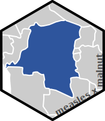

Malnutrition as an Indicator for Measles in the DRC 
====================================================================================================

<!-- badges: start -->

 <!--badges: end -->

CONTEXT
----------------------------------------------------------------------------------------------------
Malnutrition is a known risk factor for measles, similar to vaccine coverage. We aim to assess which malnutrition indicators among those collected by the PRONANUT program in the DRC perform best as indicators of measles outbreaks.

PLAN
----------------------------------------------------------------------------------------------------

- [x] setup
- [x] get data - manual
- [ ] get data - pipeline
- [ ] initial maps - malnut + vax coverage
  - [ ] zone
  - [ ] prov
- [ ] association w/ measles -- or by quartile ? 
  - [ ] epidemic yes/no
  - [ ] # cases
- [ ] sensitivity - volatility at prov vs zone level in malnutrition indicators
- [ ] sensitivity - colinearity between vax coverage / malnutrition
- [ ] final report

OTHER MUSINGS
----------------------------------------------------------------------------------------------------
